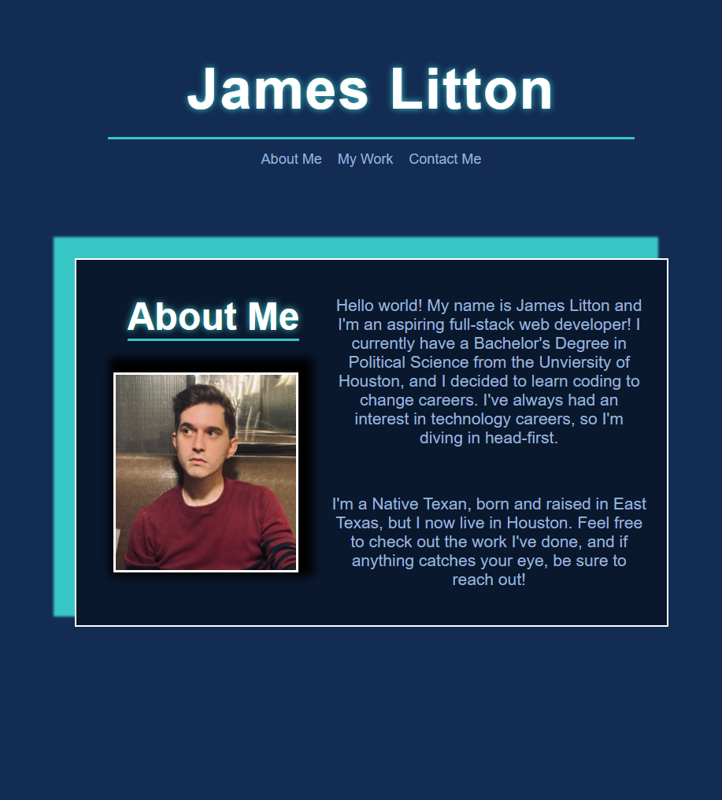

# [James Litton's Portfolio](https://jlit2594.github.io/James-Portfolio/)

## Purpose
This is an early version of what will be my portfolio. Since I'm still new at coding, I don't have very many projects to list, and the layout is fairly basic. In time, however, as I learn more tricks, I'll be able to add more content and perfect some of the features.

## How I did it
This website was built entirely in HTML and CSS, utilizing different tools I found through research. 

## Credits
This website was built entirely by myself.